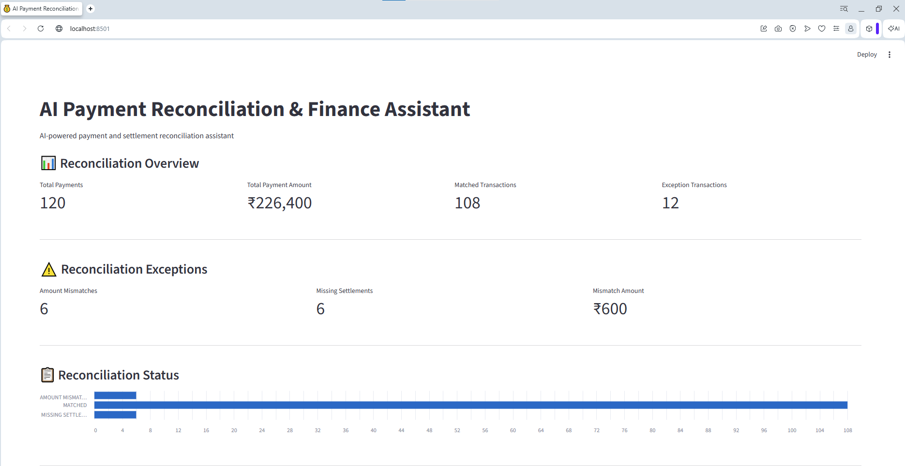
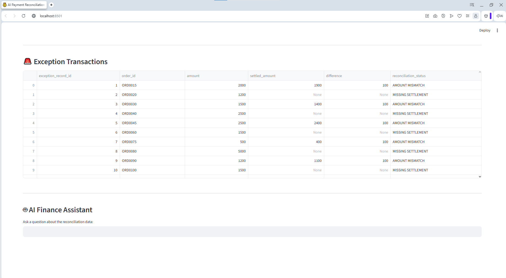
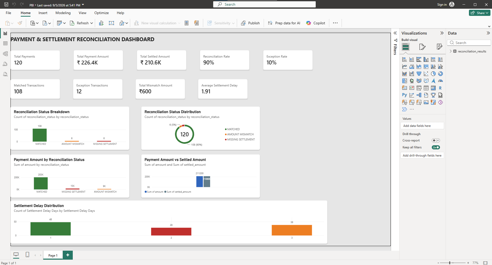

# AI Payment Reconciliation & Finance Assistant

An AI-powered payment and settlement reconciliation system that automatically compares payment records with settlement records, identifies financial exceptions, and provides an AI Finance Assistant for answering reconciliation-related questions.

## Project Overview

Payment reconciliation is an important finance operation where payment transactions are matched against settlement records to identify discrepancies.

This project automates the reconciliation workflow using **Python and Pandas** and provides an **AI Finance Assistant powered by Google Gemini** to help users understand reconciliation results through natural-language questions.

### Workflow

```text
Payments CSV + Settlements CSV
            ↓
      Python / Pandas
            ↓
   Reconciliation Engine
            ↓
   Exception Identification
            ↓
   Reconciliation Results
            ↓
    Streamlit Dashboard
            ↓
    AI Finance Assistant
```

## Key Features

- Automated payment and settlement reconciliation
- Payment-to-settlement matching using `order_id`
- Detection of amount mismatches
- Detection of missing settlements
- Detection of unmatched settlements
- Detection of duplicate settlement records
- Calculation of payment and settlement differences
- Reconciliation summary and exception reporting
- Interactive Streamlit dashboard
- Gemini-powered AI Finance Assistant
- Natural-language questions about reconciliation results
- Power BI dashboard for financial analysis

## Reconciliation Results

The project uses a synthetic dataset containing **120 payment transactions** with intentionally created exceptions to demonstrate real-world reconciliation scenarios.

| Metric | Result |
|---|---:|
| Total Payments | 120 |
| Total Payment Amount | ₹226,400 |
| Matched Transactions | 108 |
| Amount Mismatches | 6 |
| Missing Settlements | 6 |
| Total Exceptions | 12 |
| Total Mismatch Amount | ₹600 |
| Unmatched Settlements | 5 |
| Duplicate Settlement Records | 2 |

### Reconciliation Status

The reconciliation engine categorizes payment transactions as:

- `MATCHED`
- `AMOUNT MISMATCH`
- `MISSING SETTLEMENT`

Additional settlement-side exceptions are also identified:

- `UNMATCHED SETTLEMENT`
- `DUPLICATE SETTLEMENT`

## AI Finance Assistant

The AI Finance Assistant uses the **Google Gemini API** to answer questions based on the reconciliation results.

Example questions include:

- How many transactions failed reconciliation?
- What is the total mismatch amount?
- Which transactions have missing settlements?
- Which transactions have amount mismatches?
- What are the main reconciliation issues?

The reconciliation results are provided to the AI as context so that responses are based on the available project data.

## Technology Stack

| Category | Technologies |
|---|---|
| Programming | Python |
| Data Analysis | Pandas |
| Database / Data Storage | CSV |
| AI | Google Gemini API |
| Application | Streamlit |
| Visualization | Power BI, Excel |
| Development Tools | VS Code |
| Version Control | Git, GitHub |

## Project Structure

```text
ai-payment-reconciliation-finance-assistant/
│
├── Data/
│   ├── payments.csv
│   ├── settlements.csv
│   ├── reconciliation_results.csv
│   ├── reconciliation_report.csv
│   └── reconciliation_summary.csv
│
├── src/
│   ├── app.py
│   ├── generate_data.py
│   ├── reconciliation.py
│   ├── reconciliation_engine.py
│   └── test_engine.py
│
├── images/
│   ├── streamlit-dashboard-overview.png
│   ├── streamlit-exceptions-ai.png
│   └── powerbi-dashboard.png
│
├── demo/
│   └── ai-payment-reconciliation-demo.mp4
│
├── Payment_Reconciliation_Analysis.xlsx
├── PBI.pbix
├── requirements.txt
├── .gitignore
└── README.md
```

## How It Works

### 1. Load Payment Data

The system reads payment transaction data from `payments.csv`.

### 2. Load Settlement Data

Settlement information is loaded from `settlements.csv`.

### 3. Identify Duplicate Settlement Records

Duplicate settlement records are identified before performing the reconciliation analysis.

### 4. Match Transactions

Payment and settlement records are matched using the `order_id`.

### 5. Calculate Differences

For matched transactions, the system calculates the difference between the payment amount and settled amount.

```text
Difference = Payment Amount - Settled Amount
```

### 6. Determine Reconciliation Status

Each payment transaction receives a reconciliation status:

```text
MATCHED
AMOUNT MISMATCH
MISSING SETTLEMENT
```

Settlement-side exceptions are also reported:

```text
UNMATCHED SETTLEMENT
DUPLICATE SETTLEMENT
```

### 7. Generate Reports

The reconciliation engine produces:

- Reconciliation results
- Exception report
- Reconciliation summary

### 8. Analyze Results

The processed reconciliation data is displayed through the Streamlit and Power BI dashboards.

### 9. Ask Questions Using AI

The Streamlit application provides the reconciliation context to Gemini, allowing users to ask natural-language questions about the results.

## Streamlit Application

The Streamlit dashboard provides:

- Reconciliation overview
- Total payment amount
- Matched transactions
- Exception transactions
- Amount mismatches
- Missing settlements
- Mismatch amount
- Reconciliation status chart
- Exception transaction table
- AI Finance Assistant

### Dashboard Overview

The main dashboard provides a high-level view of payment reconciliation results and financial exceptions.



### Exceptions & AI Finance Assistant

The exception view provides transaction-level details and allows users to ask natural-language questions using the AI Finance Assistant.



### Demo Video

A short walkthrough demonstrating the payment reconciliation dashboard and AI Finance Assistant.

[▶ Watch the Demo Video](https://drive.google.com/file/d/1JrRDHZ455M2-c42XFvuFj1-S8LH7dTz1/view?usp=drivesdk)

## Power BI Dashboard

A Power BI dashboard was created to analyze payment and settlement reconciliation data visually.

Key dashboard metrics include:

- Total Payments
- Total Payment Amount
- Total Settled Amount
- Reconciliation Rate
- Exception Rate
- Matched Transactions
- Exception Transactions
- Total Mismatch Amount
- Average Settlement Delay

The dashboard also includes reconciliation status and settlement analysis visuals.



## Testing

The reconciliation engine was tested using the synthetic payment and settlement dataset.

Expected results:

```text
Total Payments: 120
Matched Transactions: 108
Amount Mismatches: 6
Missing Settlements: 6
Total Mismatch Amount: 600.0
```

The engine test completed successfully.

## Security

The Gemini API key is **not stored in the source code**.

It is accessed through the environment variable:

```text
GEMINI_API_KEY
```

Sensitive files and environment secrets are excluded through `.gitignore`.

## Run the Project Locally

### 1. Clone the Repository

```bash
git clone https://github.com/priyanka2005-s/ai-payment-reconciliation-finance-assistant.git
cd ai-payment-reconciliation-finance-assistant
```

### 2. Install Dependencies

```bash
pip install -r requirements.txt
```

### 3. Set the Gemini API Key

Set the `GEMINI_API_KEY` environment variable on your system.

### 4. Run the Streamlit Application

```bash
streamlit run src/app.py
```

The application will open in your browser.

## Business Value

This project demonstrates how data processing, automation, dashboards, and generative AI can support finance operations by:

- Reducing manual reconciliation effort
- Identifying financial exceptions quickly
- Providing structured exception reports
- Making reconciliation data easier to understand
- Allowing finance users to ask questions in natural language
- Combining traditional data processing with generative AI

## Future Improvements

Potential future improvements include:

- Upload payment and settlement files directly through the UI
- Automated reconciliation scheduling
- Database integration
- Role-based access control
- Automated exception alerts
- Larger datasets and performance benchmarking
- More advanced AI-based financial analysis
- Deployment to a cloud platform

## Author

**Priyanka**

Built as a practical AI + Finance automation project demonstrating Python, data analysis, reconciliation logic, generative AI, Streamlit, and Power BI.